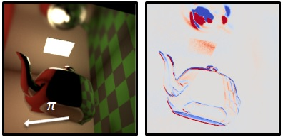

  <h1 align="center">Radiative Backpropagation with Non-Static Geometry</h1>

  

    
  

  

    <i>Eurographics Symposium on Rendering (EGSR) 2025</i>
     
    <a href="https://mworchel.github.io/"><strong>Markus Worchel</strong></a>
    ·
    <a href="https://www.cg.tu-berlin.de/people/ugo-finnendahl"><strong>Ugo Finnendahl</strong></a>
    ·
    <a href="https://www.cg.tu-berlin.de/people/marc-alexa"><strong>Marc Alexa</strong></a>
  

## About

This repository contains code to reproduce the figures of the paper "Radiative Backpropagation with Non-Static Geometry". The implementation is based on the differentiable renderer [Mitsuba 3](https://github.com/mitsuba-renderer/mitsuba3). 
- `case_1_cornell_box.ipynb`: Code for Figures 1, 2, 3.
- `case_2_cornell_box.ipynb`: Code for Figures 4, 5, 6.
- `moving_path_inset.ipynb`: Code for the inset "non-static geometry moves a path".